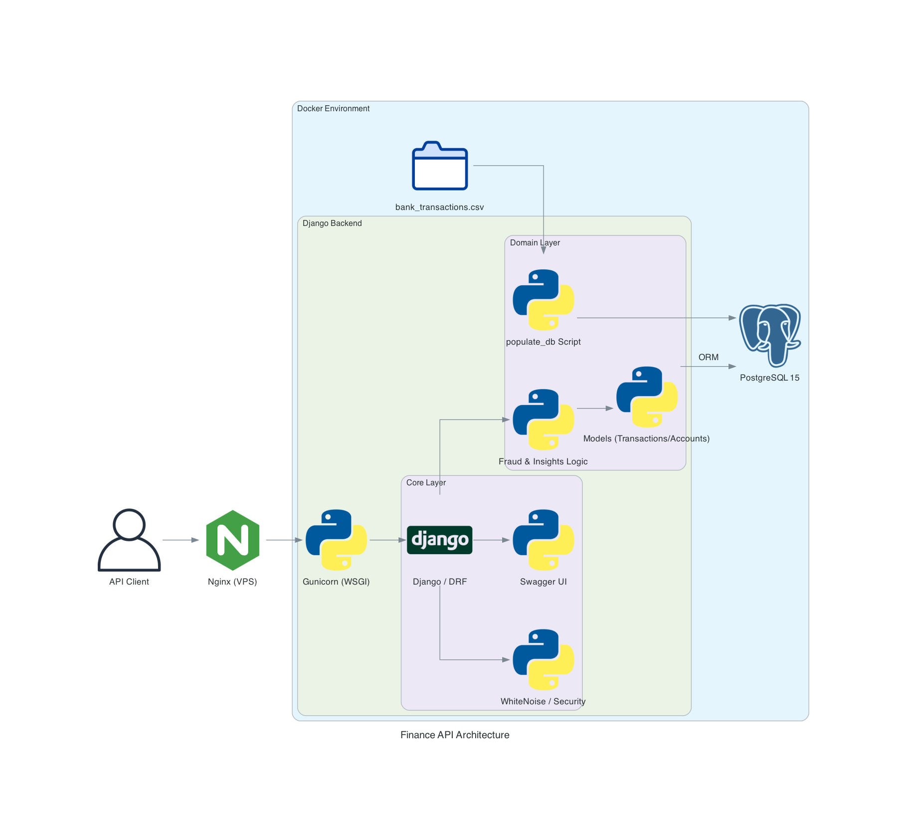

# Financial API Project

## Project Overview

The Financial API Project is a Django-based web application designed to manage and analyze financial transactions. It provides six endpoints for monitoring suspicious activity, tracking spending patterns, and generating merchant-specific reports.

The API includes the following main endpoints:

1. Transaction History - Retrieves detailed transaction records for specific accounts
2. Suspicious Activity Monitoring - Flags and monitors potentially suspicious transactions
3. Merchant Transaction Summary - Provides transaction analysis grouped by merchants
4. Transaction Management - Handles creation of new transaction records
5. Spending Analytics - Generates insights and patterns from transaction data
6. High-Frequency Account Detection - Identifies accounts with high frequancy transaction

The project serves as a comprehensive financial transaction analysis system, offering both monitoring and analytical capabilities through its RESTful API interface, built with Django REST Framework and fully documented using Swagger.

## Architecture



## Project Structure
```
Mid-term-project/
┗ financial_api/
  ┣ data_set/
  ┣ financial_api/
  ┣ transactions_app/
  ┣ Dockerfile
  ┣ Readme.md
  ┣ docker-compose.yml
  ┣ manage.py
  ┗ requirements.txt
```

## Prerequisites

### Without Docker
- Python 3.12 or higher installed
- pip (Python package manager) installed

### With Docker
- Docker installed
- Docker Compose installed

---

## How to Run the Project

### **Option 1: Run Locally Without Docker**

1. **Extract the Project Files:**
   - Extract the file to your local machine.

2. **Navigate to the Project Directory (The directory that contains the manage.py file):**
   ```bash
   cd financial_api
   ```

3. **Create a Virtual Environment:**
   ```bash
   python3 -m venv venv
   source venv/bin/activate  # For macOS/Linux
   venv\Scripts\activate   # For Windows
   ```

4. **Install Dependencies:**
   ```bash
   pip install -r requirements.txt
   ```

5. **Run Database Migrations:**
   ```bash
   python manage.py migrate
   ```

6. **Seed the Database:**
   ```bash
   python manage.py populate_db
   ```

7. **Run the Server:**
   ```bash
   python manage.py runserver
   ```

8. **Access the Application:**
   Open your browser and navigate to [http://127.0.0.1:8000](http://127.0.0.1:8000).

---

### **Option 2: Run with Docker**

1. **Extract the Project Files:**
   - Extract the file to your local machine.

2. **Navigate to the Project Directory (The directory that contains the manage.py file):**
   ```bash
   cd financial_api
   ```

3. **Build and Start the Docker Containers:**
   ```bash
   docker-compose up --build
   ```

4. **Access the Application:**
   Open your browser and navigate to [http://127.0.0.1:8000](http://127.0.0.1:8000).

---

## Additional Notes

### **Seeding the Database**
The `populate_db` management command automatically seeds the database using data from `data_set/bank_transactions_data.csv`.

### **Shutting Down Docker Containers**
To stop the Docker containers, run:
```bash
docker-compose down
```

### **Testing the Application**
To run the unit tests:
```bash
python manage.py test
```

---


## Author
Vittorio Babino
